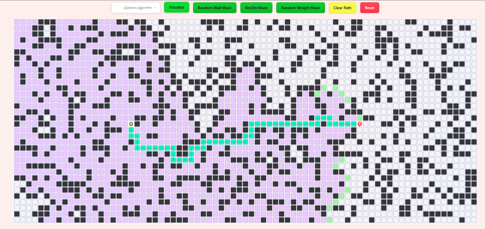
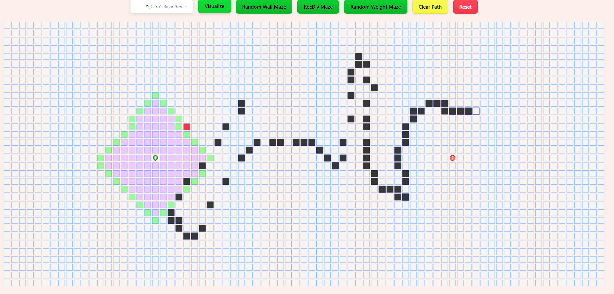
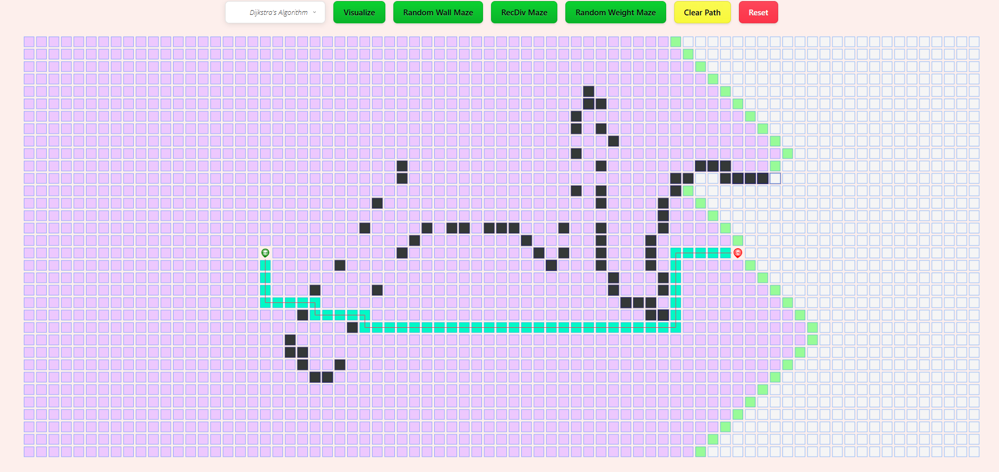

# 🚀 Algorithm Visualizer 🎨  

## 🚀 Live Demo  
🔗 https://algorithm-visualizer-eta-five.vercel.app/


## 🌟 Introduction  
**Algorithm Visualizer** is a powerful web-based tool designed to help users understand and visualize various pathfinding algorithms. With an interactive grid, customizable settings, and a visually appealing interface, this project brings algorithms to life!  

🔹 **Select an algorithm** (BFS, DFS, A*, Dijkstra, Best-First Search)  
🔹 **Generate random mazes** with different patterns   
🔹 **Clear or reset** the grid anytime  

## ✨ Features  
✅ **Multiple Algorithms** – Explore BFS, DFS, Dijkstra’s, A*, and Best-First Search.  
✅ **Interactive Grid** – Click to place start & end points, block paths, and create obstacles.  
✅ **Maze Generators** – Generate random walls. 
✅ **Dynamic Visualization** – Watch nodes expand and paths form in real time.  
✅ **Reset & Clear Options** – Restart with a clean grid effortlessly.  

## 🎮 How to Use  
1. **Select an Algorithm** from the dropdown menu.  
2. **Click “Visualize”** to watch it in action.  
3. **Generate a Maze** using one of the predefined patterns.  
4. **Use "Clear Path"** to remove the visualization while keeping the walls.  
5. **Press "Reset"** to start over from scratch.  

 

## 🛠️ Tech Stack  
- **HTML** – For structuring the webpage  
- **CSS** – For designing the visual components  
- **JavaScript** – For logic, interactivity, and animations  

## 📸 Screenshots  




## 📌 Future Enhancements  
📌 Add more algorithms like **Bellman-Ford & Floyd-Warshall**  
📌 Improve UI/UX for better user experience  
📌 Mobile-responsive design  

## 💻 Installation  
To run this project locally:  
```bash
git clone https://github.com/DhruvChouksey14/Algorithm-visualizer.git
cd Algorithm-visualizer
open index.html
